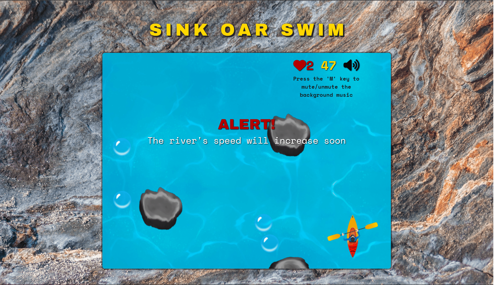

# Sink Oar Swim



[Live Game](https://yanrivera19.github.io/Sink-Oar-Swim/)


A white river kayaking game where players can speed through river rapids, dodge the rocks, and catch bubbles to increase their score. Rapids get faster periodically. Players have three lives and they lose one everytime they crash against a rock. They can get more lives by catching the red crosses, and the score value of the bubbles increases every time players reach the rapids. The goal of this project is to create a fun game for users and to make them want to improve their personal scores.

---

## Technologies Used

-   JavaScript
-   SCSS
-   HTML5
-   [Canvas API](https://developer.mozilla.org/en-US/docs/Web/API/Canvas_API)

---

## Functionality 

In Sink Oar Swim, players are able to:

- Start, pause (by pressing the letter 'space-bar' key), and reset the game after losing
- Increase their scores by catching bubbles
- Increase their lives by catching the red crosses
- Move kayak either to the left (by pressing the left arrow key) or to the right (by pressing the right arrow key)

In addition, this game includes:

- A home page and a 'how to play' page describing the background and rules of the game
- Sound effects
- Optional music playing in the background
- Score tracking

---

## Code Snippets

### Collision Detection:

 - The following code helps detect when a player either collides with a rock or catches a bubble or life and what happens after it. 
 - Thanks to the ```Window.requestAnimationFrame()``` method, these collisions are checked 60 times per second.

```javascript
// src/scripts/game.js line 262

collided(obj1, obj2) {
    if (obj1.left > obj2.right || obj1.right < obj2.left) {
      return false;
    }

    if (obj1.top > obj2.bottom || obj1.bottom < obj2.top) {
      return false;
    }

    return true;
  }

  checkRockCollisions() {
    let collisionOccuring = false;

    for (let rock of this.gameView.rocks) {
      if (this.collided(rock, this.player)) {
        collisionOccuring = true;

        if (this.lives > 0 && !this.collisionOccured) {
          this.player.hurt = true;
          setTimeout(() => {
            this.player.hurt = false;
          }, 700);
          if (this.lives > 1) oughSound.play();
          this.lives--;
          this.collisionOccured = true;
          break;
        } else if (this.lives > 0 && this.collisionOccured) {
          break;
        } else {
          bgMusic.pause();
          this.gameOff = true;
          const finalScore = document.querySelector("#final-score");
          finalScore.innerHTML = `${this.score}`;
          const gameOverModal = document.querySelector("#game-over-modal");
          gameOverModal.style.display = "flex";
          gameOverSound.play();
          break;
        }
      }
    }

    if (!collisionOccuring) {
      this.collisionOccured = false;
    }
  }

  checkCatchableCollisions() {
    this.gameView.catchables.forEach((catchable, idx) => {
      if (this.collided(catchable, this.player)) {
        if (catchable instanceof Bubble) {
          bubbleSound.play();
          this.gameView.catchables[idx].caught = true;
          this.score += this.bubbleValue;
        } else if (catchable instanceof RedCross) {
          getLifeSound.play();
          this.gameView.catchables[idx].caught = true;
          this.lives++;
        }
      }
    });
  }
```
